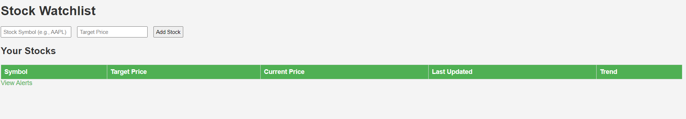
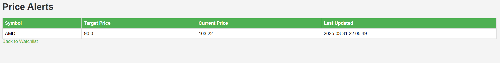

# Enhanced Stock Watchlist Application

A professional-grade stock watchlist application with real-time updates, browser notifications, and comprehensive stock tracking capabilities.

## 🚀 Features

### Core Functionality
- **Real-time Stock Tracking**: Live price updates via WebSocket connection
- **Multiple Data Sources**: Integration with yfinance, Alpha Vantage, and Finnhub APIs
- **Advanced Alert System**: Multiple alert types with sound and browser notifications
- **Modern Responsive UI**: Professional dashboard with mobile-friendly design
- **Market Summary**: Overview of portfolio performance and daily changes

### Alert Types
- **Price Above/Below**: Get notified when stock hits target price
- **Percentage Change**: Alerts for significant price movements
- **Volume Spike**: Notifications for unusual trading activity

### Notification Features
- **Browser Notifications**: Native browser notifications (requires permission)
- **Sound Alerts**: Audio notifications for triggered alerts
- **Real-time Updates**: Instant WebSocket-based price updates
- **Visual Indicators**: Color-coded price changes and status indicators

## 🛠️ Technical Stack

- **Backend**: Flask 3.1.0 with WebSocket support
- **Frontend**: Vanilla JavaScript with modern ES6+ features
- **Styling**: Custom CSS with CSS custom properties and responsive design
- **Data Sources**: 
  - yfinance (primary)
  - Alpha Vantage API (optional)
  - Finnhub API (optional)
- **Real-time**: Flask-SocketIO for WebSocket communication
- **Scheduling**: APScheduler for background tasks

## 📦 Installation

1. **Clone the repository**
   ```bash
   git clone <repository-url>
   cd "Stock Watchlist"
   ```

2. **Install dependencies**
   ```bash
   pip install -r requirements.txt
   ```

3. **Environment Setup (Optional)**
   Create a `.env` file for enhanced data sources:
   ```
   ALPHA_VANTAGE_API_KEY=your_api_key_here
   FINNHUB_API_KEY=your_api_key_here
   ```

4. **Run the application**
   ```bash
   python app.py
   ```

5. **Access the application**
   Open your browser and navigate to `http://localhost:5000`

## 🎯 Quick Start

1. **Add Stocks**: Enter stock symbols (e.g., AAPL, GOOGL, MSFT) to your watchlist
2. **Create Alerts**: Set up price alerts with different trigger conditions
3. **Enable Notifications**: Allow browser notifications for real-time alerts
4. **Monitor Portfolio**: View real-time updates and market summary

## 📱 User Interface

### Dashboard Features
- **Market Summary Cards**: Total portfolio value, daily changes, and performance metrics
- **Stock Table**: Real-time prices, changes, volume, and market cap
- **Alert Management**: Create, view, and manage your price alerts
- **Triggered Alerts**: History of activated alerts

### Navigation
- **Main Dashboard**: `/` - Primary stock watchlist and market overview
- **Alerts Page**: `/alerts` - Comprehensive alert management interface

## 🔧 Configuration

### Data Sources Priority
1. **yfinance** (default, free)
2. **Alpha Vantage** (requires API key)
3. **Finnhub** (requires API key)

### Customization Options
- **Refresh Interval**: Automatic data refresh every 30 seconds
- **Sound Notifications**: Enable/disable alert sounds
- **Browser Notifications**: Permission-based native notifications
- **Real-time Updates**: WebSocket connection for live data

## 📊 API Endpoints

### Stock Management
- `POST /add_stock` - Add stock to watchlist
- `DELETE /remove_stock/<symbol>` - Remove stock from watchlist
- `GET /api/stocks` - Get all stocks with current data

### Alert Management
- `POST /create_alert` - Create new price alert
- `DELETE /remove_alert/<id>` - Remove alert
- `GET /api/alerts` - Get all active alerts
- `GET /api/triggered_alerts` - Get triggered alerts history

### Real-time Data
- `GET /api/market_summary` - Portfolio summary statistics
- `GET /search_symbols` - Search for stock symbols
- `WebSocket /ws` - Real-time price updates and notifications

## 🔒 Security Features

- **Input Validation**: Server-side validation for all inputs
- **Error Handling**: Comprehensive error handling with user feedback
- **Rate Limiting**: Built-in protection against API abuse
- **Safe Data Sources**: Using reputable financial data providers

## 🎨 UI/UX Features

- **Modern Design**: Clean, professional interface with intuitive navigation
- **Responsive Layout**: Optimized for desktop, tablet, and mobile devices
- **Color-coded Data**: Visual indicators for price changes and alert status
- **Loading States**: Smooth transitions and loading indicators
- **Empty States**: Helpful guidance for new users

## 🚨 Alert System

### Alert Configuration
- **Symbol**: Stock ticker symbol
- **Alert Type**: Price above/below, percentage change, volume spike
- **Target Value**: Trigger threshold
- **Notifications**: Sound and browser notification options

### Alert Lifecycle
1. **Created**: Alert is active and monitoring
2. **Triggered**: Condition met, notifications sent
3. **History**: View triggered alerts with timestamps

## 📈 Performance

- **Real-time Updates**: WebSocket connection for instant data
- **Efficient Caching**: Smart data caching to reduce API calls
- **Background Processing**: Non-blocking alert checking
- **Optimized Frontend**: Minimal dependencies, fast loading

## 🔮 Future Enhancements

- **Stock Charts**: Interactive price charts with technical indicators
- **Portfolio Analytics**: Advanced performance metrics and analysis
- **Social Features**: Share watchlists and alerts
- **Mobile App**: Native mobile application
- **More Data Sources**: Additional financial data providers
- **Advanced Alerts**: Complex multi-condition alerts

## 🤝 Contributing

1. Fork the repository
2. Create a feature branch
3. Make your changes
4. Add tests if applicable
5. Submit a pull request

## 📄 License

This project is open source and available under the MIT License.

## 📞 Support

For questions, issues, or feature requests, please create an issue in the repository.

---

## Screenshots

### Dashboard Overview


### Stock Watchlist


Example of a stock watchlist page with AMD and NVDA included


### Alert Management


Example of an alert page with AMD stock


### Real-time Notifications


*Built with ❤️ for stock market enthusiasts*
